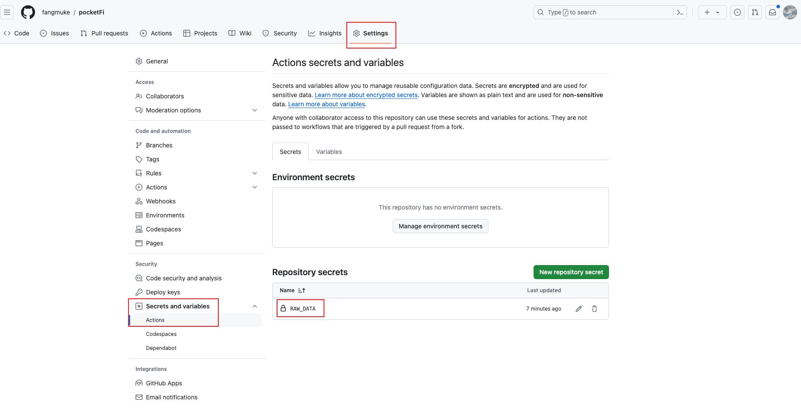

# pocketFi

### 提取data

1. 打开[Telegram Web](https://web.telegram.org/a/#654647202)
2. 打开DevTools并打开Web应用程序
3. 在`bot.pocketfi.org`的任何请求的Header中查找`telegramRawdata`

### 设置变量



### 格式如下

```json
[
  {
    "query_id": "******",
    "user": "{\"id\":*****,\"first_name\":\"**\",\"last_name\":\"**\",\"username\":\"****\",\"language_code\":\"en\",\"allows_write_to_pm\":true}",
    "auth_date": "*****",
    "hash": "*****"
  },
  {
    "query_id": "******",
    "user": "{\"id\":*****,\"first_name\":\"**\",\"last_name\":\"**\",\"username\":\"***\",\"language_code\":\"zh-hans\",\"is_premium\":true,\"allows_write_to_pm\":true}",
    "auth_date": "*****",
    "hash": "*******"
  }
]
```
